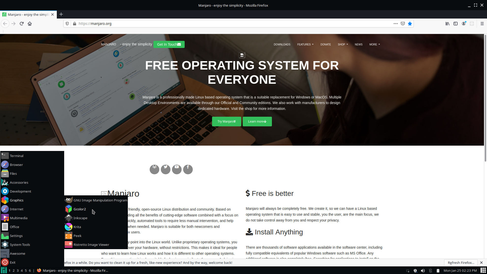

# awesome-cleanmono

This is a theme for AwesomeWM.

## Installation

Clone the repo, then move the contents of `awesome-cleanmono/` into `~/.config/awesome/`.

## Changing the Timezone

The theme is configured for EST. To change the timezone, edit the third parameter on this line in `rc.lua` (i.e. "0:00"):

`mytextclock = wibox.widget.textclock("   %a %h %d %I:%M %p ", 60, "0:00")`

See [this page](https://awesomewm.org/doc/api/classes/wibox.widget.textclock.html#wibox.widget.textclock) for info on valid timezone formats.
